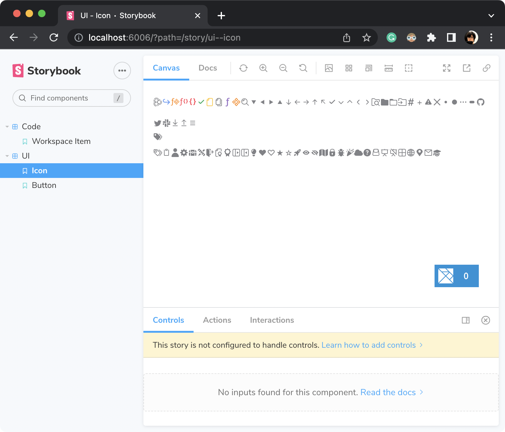
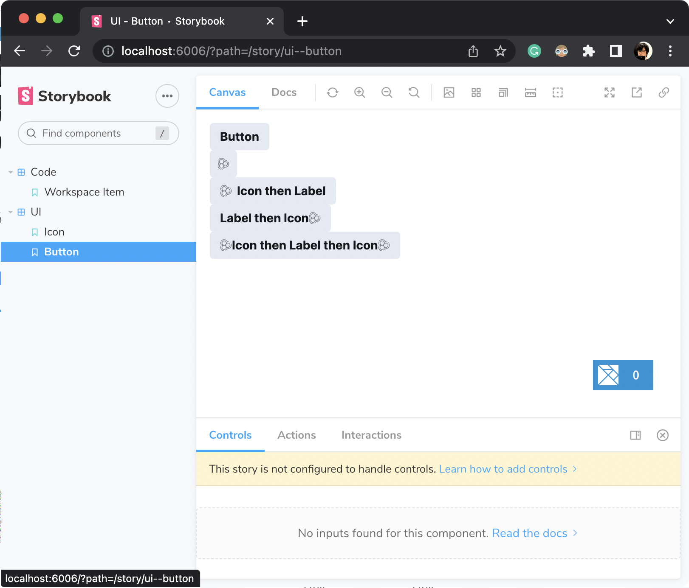
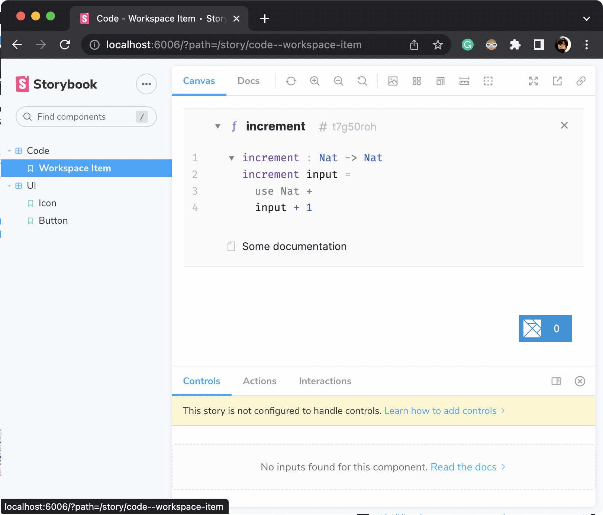

# Unison-UICore Storybook

Showing [Unison UI Core](https://github.com/unisonweb/ui-core) elements in [Storybook](https://storybook.js.org/).

## Usage
```sh
$ npm install
$ npm run storybook
```

## Samples




## Reference
- [Storybook and Elm](https://orangesodium.cc/ui/elm/2022/04/06/storybook-and-elm.html)